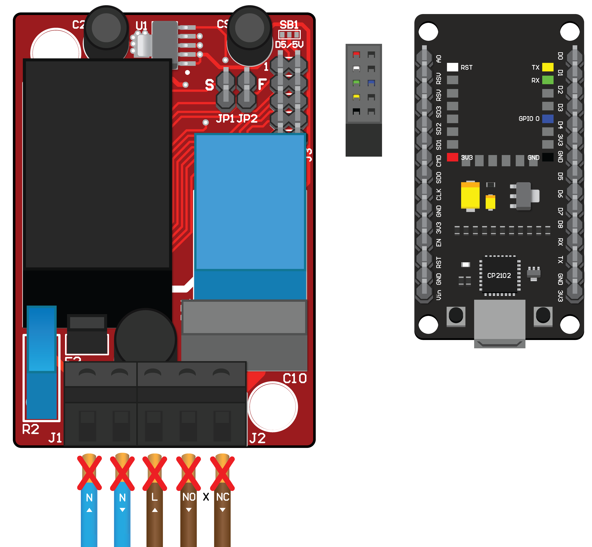
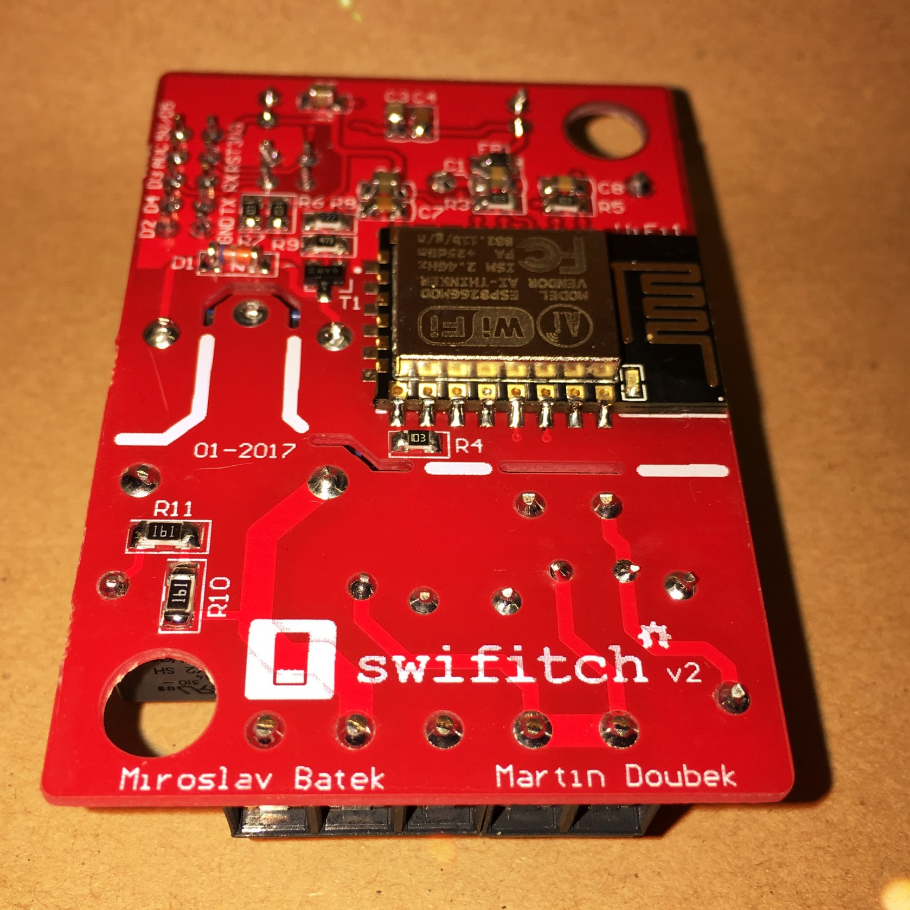
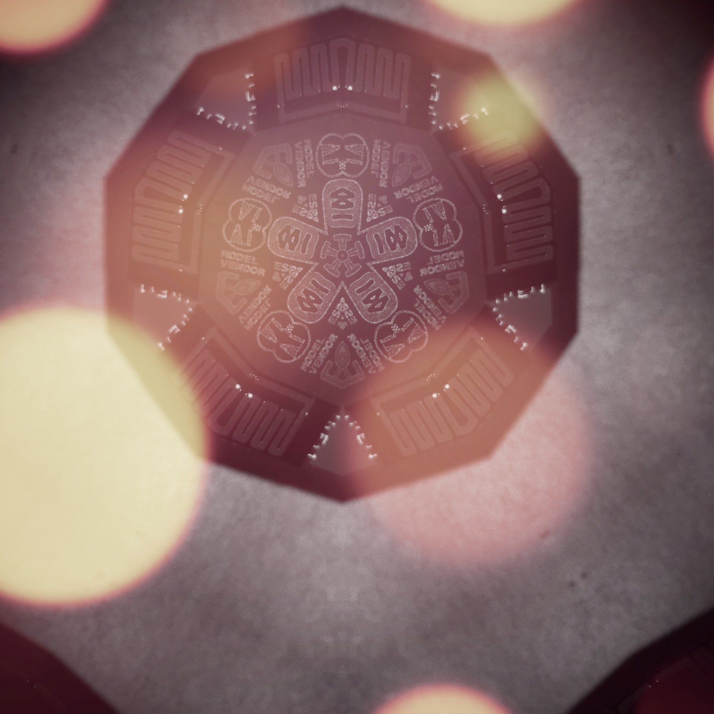

## Table of contents

- [Introduction](https://github.com/ArnieX/swifitch#introduction)
	- [What is it?](https://github.com/ArnieX/swifitch#what-is-it)
	- [What can it do?](https://github.com/ArnieX/swifitch#what-can-it-do)
	- [What is expected cost?](https://github.com/ArnieX/swifitch#what-is-expected-cost)
	- [How does it look like?](https://github.com/ArnieX/swifitch#how-does-it-look-like)
	- [How big is it?](https://github.com/ArnieX/swifitch#how-big-is-it)
	- [Is it safe?](https://github.com/ArnieX/swifitch#is-it-safe)
	- [OK I'm sold! What do I need to build it?](https://github.com/ArnieX/swifitch#ok-im-sold-what-do-i-need-to-build-it)
- [SeeedStudio Fusion PCB](https://github.com/ArnieX/swifitch#seeedstudio-fusion-pcb)
	- [How to order PCBs](https://github.com/ArnieX/swifitch#how-to-order-pcbs)
-  [After you build it](https://github.com/ArnieX/swifitch#after-you-build-it)
	- [OK DONE! What's next?](https://github.com/ArnieX/swifitch#ok-done-whats-next)
- [Software](https://github.com/ArnieX/swifitch#software)
	- [Swifitch default software](https://github.com/ArnieX/swifitch#swifitch-default-software)
	- [Custom software](https://github.com/ArnieX/swifitch#custom-software)
- [Enclosure](https://github.com/ArnieX/swifitch#enclosure)
	- [3D Printed](https://github.com/ArnieX/swifitch#3d-printed)
	- [Purchased ABS box](https://github.com/ArnieX/swifitch#purchased-abs-box)
- [Soldering cheatsheet](https://github.com/ArnieX/swifitch#soldering-cheatsheet)
	- [Back side](https://github.com/ArnieX/swifitch#back-side)
	- [Front side](https://github.com/ArnieX/swifitch#front-side)
- [Credits](https://github.com/ArnieX/swifitch#credits)
- [What's next?](https://github.com/ArnieX/swifitch#whats-next)
- [Photos](https://github.com/ArnieX/swifitch#photos)

# Introduction

### What is it?

ESP8266 based WiFi enabled relay board, that will let you easily turn any light or any plug to SMART one. Easily control using HomeKit (other HW needed) or using any MQTT based SmartHome application. Or if you are skilled developer, write any code you want.

### What can it do?

Main purpose is to turn things ON or OFF. But it can do lot more than that, swifitch is equiped with header to connect another 4 digital devices and 1 analog. These could be sensors etc.

If you need, by sacrificing one of the data pins, you can get 5V for your 5V sensors.

**⛔  Be aware that swifitch's pins are not 5V tolerant and cannot accept 5V on any of the pins provided, and it will damage the ESP.**

There are also two jumpers. One is for enabling deep sleep and the other is to put ESP into flash mode when you use conventional USB2UART programmer. We have reused one NodeMCU to make a lot more convenient programmer out of it, because it handles resets and flash mode boot automatically. Details will follow.

### What is expected cost?

We have designed swifitch to be both cheap and safe. So it is not ultra cheap but not expensive too. **Our cost calculations has stoped at $8!** Not bad, what you think?

### How does it look like?

Definitely beautiful!!

### How big is it?

Actually very small, you should be able to fit it almost anywhere without any hassle. But I know, numbers tell it all, so here it is.

|**Width**|**Height**|**Depth**|**Weight W/O BOX**|**Weight W/ BOX**|
|---|---|---|---|---|
| 42mm / 1.65" | 60.5mm / 2.36" | 19.6mm / 0.77" | ~42g / ~1.48oz | ~72g / ~2.54oz  |

### Is it safe?

We have designed few safety features in swifitch. Most important are fuses on mains input. There is one overcurrent fuse and one overvoltage fuse (surge protection), and more importantly temperature fuse that will disconnect swifitch from mains input when temperature raises above 100°C. There should be another few safeties in HLK-PM01 but we didn't want to depend on it's quality. 

### OK I'm sold! What do I need to build it?

**Capacitors**

|Preview|Part|Buy|
|---|---|---|
||4.7μF 0805||
||100nF 0805||
||10nF 0805||
||47μF ⌀6.3x5mm| |
||47nF X2| |

**Resistors**

|Preview|Part|Buy|
|---|---|---|
||10kΩ 0805||
||1.5kΩ 0805||
||2.2kΩ 0805||
||47kΩ 0805||
||160Ω 1206||
||S10K275| |

**Power and Controls**

|Preview|Part|Buy|
|---|---|---|
||SCHURTER MSF 250VAC 500mA Fuse| |
||PROFFUSE TZ-P100/2 100°C Fuse||
||Hi-Link HLK-PM01 AC-DC 5V/3W||
||SRD-05VDC-SL-C Relay||

**Other SMD Parts**

|Preview|Part|Buy|
|---|---|---|
||BC817-16.215|  |
||BAS86| |
||MCP1825T-3302E/DC Voltage Regulator| |
||Ferrite Bead 600Ω 100MHz 0805||
||Any 0805 LED diode||

**Connectors**

|Preview|Part|Buy|
|---|---|---|
||Headers 1x2 2.54mm pitch||
||Headers 2x5 2.54mm pitch||
||Terminal 2P and 3P, 5.08mm pitch rounded lead||

**The rest**

|Preview|Part|Buy|
|---|---|---|
||ESP8266-12(E/F/S)||
||PCB||

Most of it could be purchased on AliExpress or eBay for what we call "no money", some parts are safer to get from your local trusted electricians shop (fuse and relay if you do not want chinese).

Most AliExpress links in table above are tested and trusted sellers, but we do not give any guarantees.

TME.eu is good source for EU citizens and especially guys in Czech Republic.

Farnell should be OK for all over world.

# SeeedStudio Fusion PCB

### How to order PCBs

First grab gerber files ZIP and upload it to SeeedStudio Fusion then follow instructions below.

We have created sreenshots from ordering process so you can recreate the process in same manner. Decide how many pieces you want and get started. Keep in mind that each board are actually two swifitches ;). That makes it even cheaper.

Gerber files preview:

# After you build it

### OK DONE! What's next?

Now you need to flash some software to it. Either use conventional CP2102 USB2UART programmer or build your own as we did from NodeMCU, it is definitely best option you have.

This image tell you all you need to know but basically this is the list of steps:

- Desolder ESP8266 from NodeMCU (Heatgun baby!! But carefully you can use it for swifitch then.)
- Solder colored wires to the contacts according to image below
- Insert these wires to 2x5, 2.54mm pitch connector
- Connect to swifitch and flash firmware

We have created software for you to get started quicky so go to it's own [repository](https://github.com/ArnieX/swifitch-software).

**⚡ DO NOT CONNECT SWIFITCH TO MAINS VOLTAGE WHEN FLASHING ⚡**

It should be safe, but we do not recommend it!

# Software

### Swifitch default software

If you went with our software you are good to go, just follow the README in the [repository](https://github.com/ArnieX/swifitch-software).

### Custom software

Just few things you need to know if you develop your own software.

- Relay is controled by D1 or GPIO5 PIN
- Built in LED is controled by D6 or GPIO12 PIN

# Enclosure

### 3D Printed

If you have access to 3D printer, have a look at our original swifitch box.

**This is experimental, not printed yet. Feel free to be first one.**

Use ABS plastic filament as this device is using mains voltage and ABS is safer for such devices.

**DO NOT USE CONDUCTIVE FILAMENTS**

### Purchased ABS box

We have fitted swifitch to box that can be purchased from various electrical shops. May not be available in all countries thought.

# Soldering cheatsheet

### Back side

Start with SMD parts on the BACK side.

**Capacitors**

|Slot|Part|
|---|---|
|C1|4.7μF|
|C3|4.7μF|
|C5|4.7μF|
|C6|4.7μF|
|C4|100nF|
|C7|100nF|
|C8|10nF|

**Resistors**

|Slot|Part|
|---|---|
|R3|10kΩ|
|R4|10kΩ|
|R5|10kΩ|
|R6|10kΩ|
|R7|10kΩ|
|R8|2.2kΩ|
|R9|47kΩ|
|R10|160Ω|
|R11|160Ω|

**The rest**

|Slot|Part|
|---|---|
|FB1|FB 600Ω 100MHz|
|D1|BAS86|
|T1|BS817|
|WiFi1|ESP8266-12(E/F/S)|

### Front side

Front side contains mostly THT parts, but start with SMD parts that would be harder to solder when you finish all bigger parts.

**SMD**

|Slot|Part|
|---|---|
|R1|470Ω > 2kΩ (depends on LED1)|
|LED1|Choose color you like|
|V1|Voltage Regulator|

**THT**

|Slot|Part|
|---|---|
|DC1|HLK-PM01|
|F2|100°C fuse|
|R2|S10K275|
|F1|MSF250/0.5A|
|C10|47nF|
|C2|47μF|
|C9|47μF|
|SB1|Optionaly enable D5 or 5V|
|JP1|1x2 header|
|JP2|1x2 header|
|J3|2x5 header|
|RE1|Relay|
|J1|2P terminal|
|J2|3P terminal|

**🎉 DONE 🎉**

# Credits

- PCB design, electronics ideas, parts selection - Miroslav Batěk
- SW, Git Repo, design - Martin Doubek

# What's next?

If you liked swifitch and want to submerge deeper into IoT we will reference some other projects here.

- [tjclement's ESP8266 dimmer HW for LED Strips](https://github.com/tjclement/esp-dimmer-hardware)

# Photos

 
 

