||[Readme in English](https://github.com/ArnieX/swifitch/blob/master/README.md)|
|---|---|

## Obsah

- [Úvod](https://github.com/ArnieX/swifitch/blob/master/README_CZ.md#úvod)
	- [Co to je?](https://github.com/ArnieX/swifitch/blob/master/README_CZ.md#co-to-je)
	- [Co to umí?](https://github.com/ArnieX/swifitch/blob/master/README_CZ.md#co-to-umí)
	- [Na kolik to vyjde?](https://github.com/ArnieX/swifitch/blob/master/README_CZ.md#na-kolik-to-vyjde)
	- [Jak to vypadá?](https://github.com/ArnieX/swifitch/blob/master/README_CZ.md#jak-to-vypadá)
	- [Jak je to velké?](https://github.com/ArnieX/swifitch/blob/master/README_CZ.md#jak-je-to-velké)
	- [Co bezpečnost?](https://github.com/ArnieX/swifitch/blob/master/README_CZ.md#co-bezpečnost)
	- [Chci to! Co potřebuji koupit?](https://github.com/ArnieX/swifitch/blob/master/README_CZ.md#chci-to-co-potřebuji-koupit)
- [SeeedStudio Fusion PCB](https://github.com/ArnieX/swifitch/blob/master/README_CZ.md#seeedstudio-fusion-pcb)
	- [Jak objednat plošné spoje](https://github.com/ArnieX/swifitch/blob/master/README_CZ.md#jak-objednat-plošné-spoje)
-  [Po sestavení](https://github.com/ArnieX/swifitch/blob/master/README_CZ.md#po-sestavení)
	- [Hotovo! Co dál?](https://github.com/ArnieX/swifitch/blob/master/README_CZ.md#hotovo-co-dál)
- [Software](https://github.com/ArnieX/swifitch/blob/master/README_CZ.md#software)
	- [Náš základní software](https://github.com/ArnieX/swifitch/blob/master/README_CZ.md#náš-základní-software)
	- [Vlastní software](https://github.com/ArnieX/swifitch/blob/master/README_CZ.md#vlastní-software)
- [Krabička](https://github.com/ArnieX/swifitch/blob/master/README_CZ.md#krabička)
	- [Vytištěná na 3D tiskárně](https://github.com/ArnieX/swifitch/blob/master/README_CZ.md#vytištěná-na-3d-tiskárně)
	- [Kupovaná krabička](https://github.com/ArnieX/swifitch/blob/master/README_CZ.md#kupovaná-krabička)
- [Návod na pájení](https://github.com/ArnieX/swifitch/blob/master/README_CZ.md#návod-na-pájení)
	- [Zadní strana](https://github.com/ArnieX/swifitch/blob/master/README_CZ.md#zadní-strana)
	- [Přední strana](https://github.com/ArnieX/swifitch/blob/master/README_CZ.md#přední-strana)
- [Zásluhy](https://github.com/ArnieX/swifitch/blob/master/README_CZ.md#zásluhy)
- [Co dál?](https://github.com/ArnieX/swifitch/blob/master/README_CZ.md#co-dál)
- [Fotografie](https://github.com/ArnieX/swifitch/blob/master/README_CZ.md#fotografie)

# Úvod

### Co to je?

Swifitch je zjednodušeně WiFi spínač, založený na známém modulu ESP8266 ve verzi 12(E,F,S) a umožní vám proměnit jakékoliv světlo nebo zásuvku v dálkově ovládanou. Pak lze ovládat přes HomeKit (Potřeba dalšího zařízení - serveru) nebo přes jakoukoliv aplikaci, která umožňuje ovládání přes protokoly MQTT nebo HTTP. Velice záleží na softwaru, který si do zařízení nahrajete.

### Co to umí?

Jak už z názvu vyplývá hlavní funkcí je připojené zařízení zapínat nebo vypínat. Tím to ale nekončí, přidali jsme rozhraní pro připojení dalších 4 digitálních a jednoho analogového zařízení, tím může být prakticky cokoliv, teplotní čidlo, senzor pohybu nebo jiný senzor či modul.

Obětováním jednoho datového pinu lze získat 5V pro senzory nebo jiné moduly vyžadujících pro svou činnost 5V.

**⛔  Pozor, swifitch přesto, že umožňuje aktivaci výstupu 5V neumožňuje vstup 5V na žádném dostupném pinu, pokud byste připojili 5V na některý pin, zničíte modul ESP8266.**

Kromě vstupně-výstupních pinů jsou k dispozici také dvě přemostění, první umožňuje využití režimu hlubokého spánku, druhé je nezbytné pokud pro nahrávání softwaru budete využívat běžný USB2UART programátor. Naše doporučení je využít pro programování upravený NodeMCU vývojový modul a to proto, že se sám stará o aktivaci flashovacího režimu a restarty modulu, víc dále.

### Na kolik to vyjde?

Navrhli jsme swifitch aby byl levný a zároveň bezpečný, takže není ani extrémně levný, ale ani drahý. **Celková konečná cena druhé verze je přibližně 215Kč!** To není zlé co myslíte?

### Jak to vypadá?

Naprosto a jednoznačně krásně!

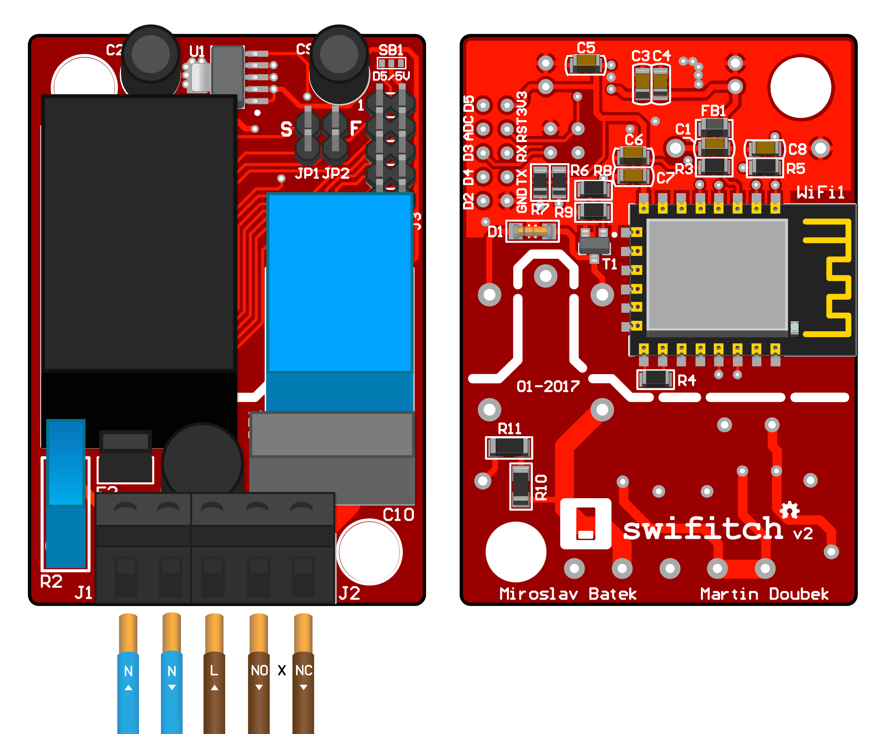

### Jak je to velké?

Velké ani ne, spíše malé. Neměl by být problém napasovat swifitch kamkoliv jej budete chtít umístit. Je mi to jasné, čísla to poví lépe.

|**Šířka**|**Výška**|**Hloubka**|**Váha bez krabičky**|**Váha s krabičkou**|
|---|---|---|---|---|
| 42mm | 60.5mm | 19.6mm | ~42g | ~72g |

### Co bezpečnost?

Při navrhování swifitche byla bezpečnost jednou z priorit a rozhodně jsme ji nezanedbali. Hlavní bezpečnostní prvky jsou na vstupu z rozvodné sítě. Je zde pojistka proti nadměrnému odběru (zkratu), pojistka proti přepětí a teplotní pojistka, která vypne napájení při překročení teploty 100°C. Další pojistné mechanismy by měl obsahovat přímo zdroj HLK-PM01, nechtěli jsme však spoléhat na jejich kvalitu.

### Chci to! Co potřebuji koupit?

**Kondenzátory**

|Náhled|Součástka|Koupit|
|---|---|---|
|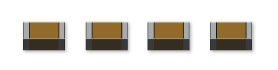|4.7μF 0805||
|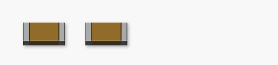|100nF 0805||
||10nF 0805||
|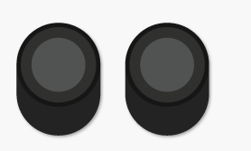|47μF ⌀6.3x5mm| |
||47nF X2| |

**Odpory**

|Náhled|Součástka|Koupit|
|---|---|---|
|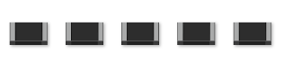|10kΩ 0805||
|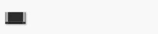|1.5kΩ 0805||
||2.2kΩ 0805||
||47kΩ 0805||
||160Ω 1206||
||S10K275| |

**Napájení a ovládací prvky**

|Náhled|Součástka|Koupit|
|---|---|---|
||SCHURTER MSF 250VAC 500mA| |
|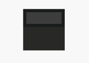|PROFFUSE TZ-P100/2 100°C nebo podobná| |
||Hi-Link HLK-PM01 AC-DC 5V/3W||
|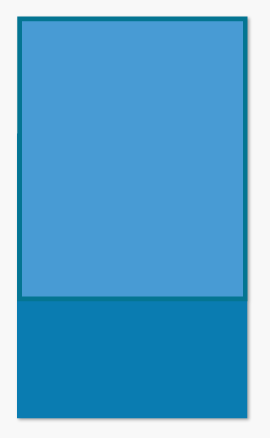|SRD-05VDC-SL-C relé FINDER  36.11.9.005.4011|  |

**Další SMD součástky**

|Náhled|Součástka|Koupit|
|---|---|---|
||BC817-16.215|  |
|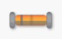|BAS86| |
|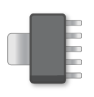|MCP1825T-3302E/DC Regulátor Napětí| |
||Feritová perla 600Ω 100MHz 0805|  |
||Libovolná 0805 LED dioda||

**Konektory**

|Náhled|Součástka|Koupit|
|---|---|---|
|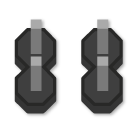|Oboustranný kolík 1x2 s roztečí 2.54mm ||
|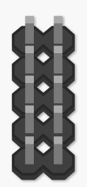|Oboustranný kolík 2x5 s roztečí 2.54mm||
|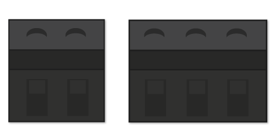|Svorkovnice 2P a 3P, s roztečí 5.08mm a kulatým vývodem||

**Zbytek**

|Náhled|Součástka|Koupit|
|---|---|---|
|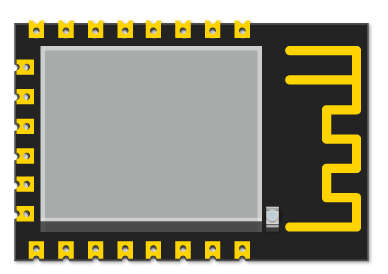|ESP8266-12(E/F/S)||
|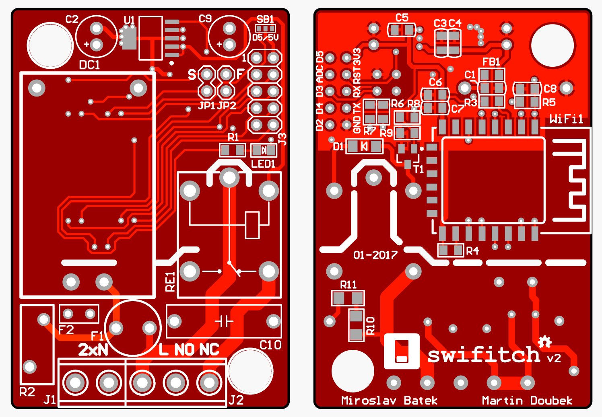|Plošné spoje||

Většinu lze zakoupit na AliExpressu nebo eBay a to za ceny, že ani není třeba to komentovat. Některé součástky je lepší nebo i výhodnější zakoupit od místních prodejců elektroniky.

Většina odkazů na jednotlivé díly v tabulkách výše je prověřená, nicméně neposkytujeme žádné záruky.

Pro nás Čechy a popř. Slováky, bude dobrým zdrojem většiny dílů, které nelze zakoupit přes Alíka obchod TME.eu, poštovné je také za hubičku.

Pro ty ostatní je zde ještě Farnell

# SeeedStudio Fusion PCB

### Jak objednat plošné spoje

Stáhněte si ZIP soubor obsahující soubory "Gerber" a celý jej nahrajte do objednávacího procesu na [SeeedStudio Fusion PCB webu](http://swifitch.cz/therest_pcb) a postupujte podle instrukcí na webu a níže.

Připravili jsme pro vás snímky obrazovky z objednávkového procesu, když jsme plošné spoje objednávali naposledy a tak můžete snadno vyplnit stejné hodnoty. Vyberte si počet plošných spojů a mějte na paměti, že 1ks jsou dva. Za stejnou cenu se nám podařilo na jednu desku dostat dvě.

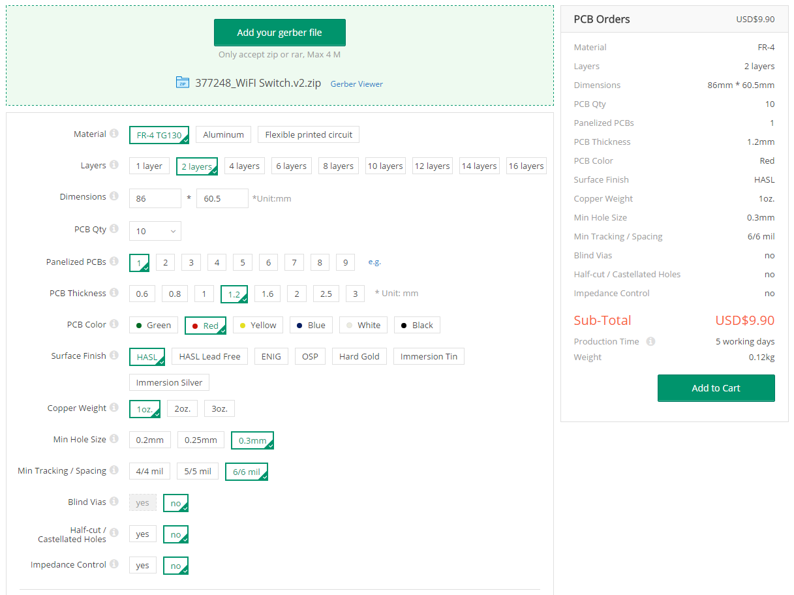

Náhled na obsah Gerber souborů:

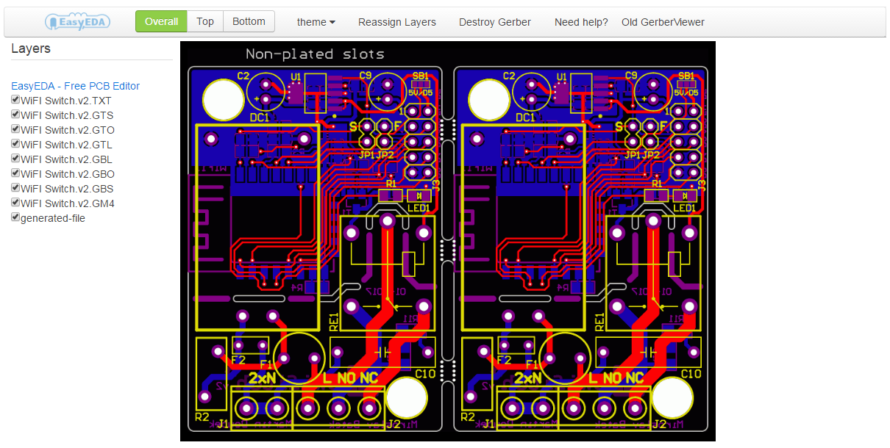

# Po sestavení

### Hotovo! Co dál?

Po sestavení přichází na řadu nahrání softwaru. Můžete buďto použít běžný USB2UART programátor nebo vyrobit vlastní úpravou NodeMCU. Je to levná varianta, efektivní a ještě získáte jeden modul ESP8266 na výrobu swifitche.

Obrázek níže přesně ukazuje čeho potřebujete dosáhnout, přesto pár kroků jak na to.

- Pomocí horkovzdušné pistole odpájejte modul ESP8266. Opatrně ať si nepoškodíte ani ESPčko ani NodeMCU.
- Připájejte barevné vodiče dle obrázku
- Vložte vodiče do konektoru 2x5 s roztečí 2.54mm
- Připojte swifitch a nahrajte software.

Připravili jsme pro vás náš software aby byl začátek co nejsnazší, pokračujte do jeho [repozitáře](http://swifitch.cz/software).

**⚡ PŘI FLASHOVÁNÍ SOFTWARU NEPŘIPOJUJTE SWIFITCH K ROZVODNÉ SÍTI ⚡**

Mělo by to být bezpečné, přesto to nedoporučujeme.

# Software

### Náš základní software 

Pokud jste se rozhodli pro náš software tak postupujte dle README v jeho [repozitáři](http://swifitch.cz/software).

### Vlastní software

Pokud se rozhodnete napsat vlastní software, jen do toho, zde jen pár faktů, které potřebujete znát.

- Relé je ovládané přes pin D1 nebo GPIO5
- Vestavěná LED dioda se spíná přes pin D6 nebo GPIO12

# Krabička

### Vytištěná na 3D tiskárně

Pokud máte přístup ke 3D tiskárně, můžete si vytisknout naší 3D krabičku.

**Nevyzkoušeno, klidně můžete být první.**

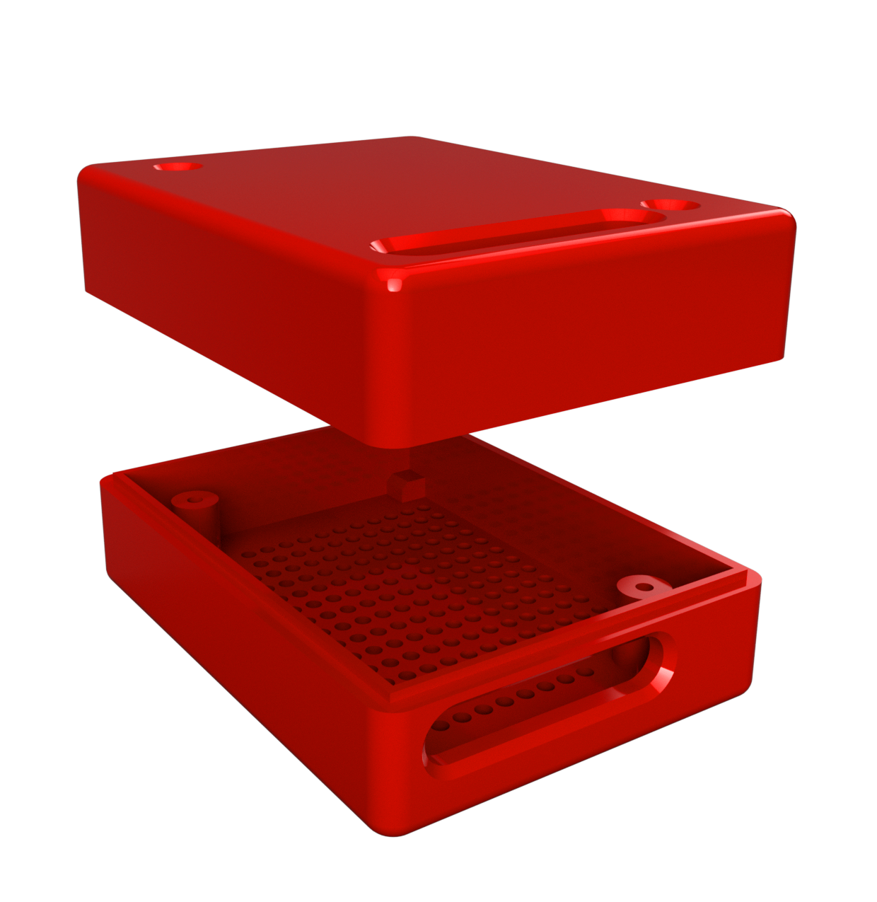

Doporučujeme tisk z ABS, neboť je to bezpečnější materiál pro zařízení napajené z rozvodné sítě.

**NEPOUŽÍVEJTE K TISKU VODIVÉ MATERIÁLY NEBO TY S PŘÍMĚSÍ KOVŮ**

### Kupovaná krabička

Swifitch byl navržen primárně pro umístění do krabičky běžně [dostupné](http://swifitch.cz/cz/enclosure), je však nutné jí drobně upravit, postačí vrtačka a vrtáky na kov.

# Návod na pájení

### Zadní strana

Začněte na zadní straně postupně s SMD součástkami.

**Kondenzátory**

|Pozice|Součástka|
|---|---|
|C1|4.7μF|
|C3|4.7μF|
|C5|4.7μF|
|C6|4.7μF|
|C4|100nF|
|C7|100nF|
|C8|10nF|

**Odpory**

|Pozice|Součástka|
|---|---|
|R3|10kΩ|
|R4|10kΩ|
|R5|10kΩ|
|R6|10kΩ|
|R7|10kΩ|
|R8|2.2kΩ|
|R9|47kΩ|
|R10|160Ω|
|R11|160Ω|

**Zbytek**

|Pozice|Součástka|
|---|---|
|FB1|Feritová perla 600Ω 100MHz|
|D1|BAS86|
|T1|BC817|
|WiFi1|ESP8266-12(E/F/S)|

### Přední strana

Přední strana obsahuje většinově THT součástky, proto začněte s SMD součástkami, které by bylo obtížné pájet později.

**SMD**

|Pozice|Součástka|
|---|---|
|R1|470Ω < Rled < 2kΩ (záleží na LED1)|
|LED1|Barva dle výběru|
|V1|Regulátor Napětí|

**THT**

|Pozice|Součástka|
|---|---|
|DC1|HLK-PM01|
|F2|100°C tepelná pojistka|
|R2|S10K275|
|F1|MSF250/0.5A|
|C10|47nF|
|C2|47μF|
|C9|47μF|
|SB1|Pájecí propojka pro volbu D5 nebo výstupu 5V|
|JP1|1x2 kolík|
|JP2|1x2 kolík|
|J3|2x5 kolík|
|RE1|Relé|
|J1|2P svorkovnice|
|J2|3P svorkovnice|

**🎉 HOTOVO 🎉**

# Zásluhy

- návrhy plošných spojů, nápady ohledně elektroniky, výběr vhodných součástek - Miroslav Batěk
- SW, Git Repo, grafika, 3D krabička - Martin Doubek

# Co dál?

Pokud se vám swifitch zalíbil a chcete ve výbavě chytré domácnosti pokračovat, doporučujeme tyto další projekty.

- [ESP8266 stmívací modul pro LED pásky od uživatele tjclement](https://github.com/tjclement/esp-dimmer-hardware)

Popřípadě tyto IoT platformy, nebo enablery.

- [Homebridge - vlastní HomeKit server](https://github.com/nfarina/homebridge)
	- [Homebridge MQTT plugin](https://github.com/cflurin/homebridge-mqtt)
- [Blynk - plaforma a aplikace pro IoT - lze použít se Swifitchem](https://github.com/blynkkk/blynk-server)

# Fotografie

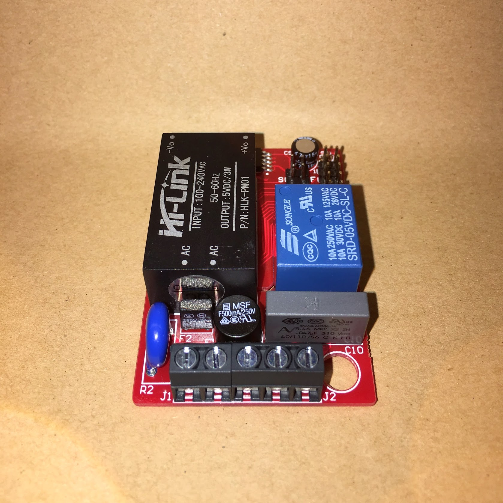 
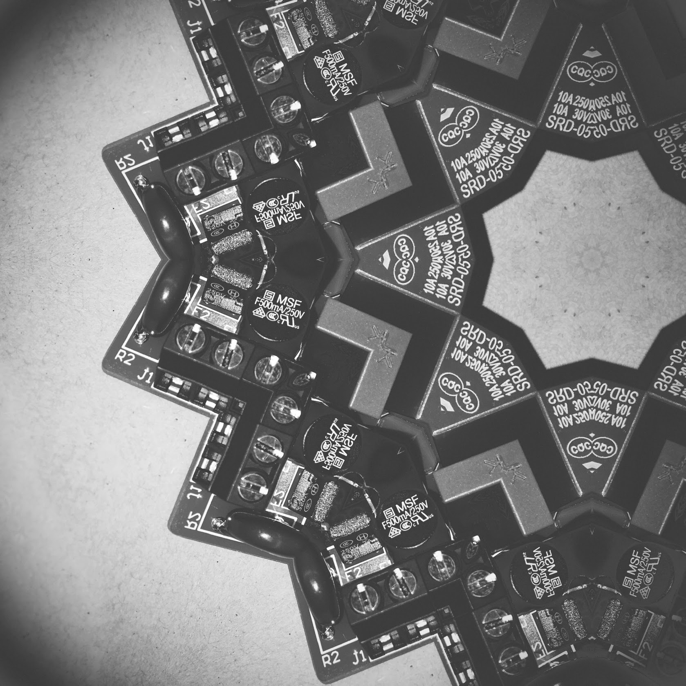 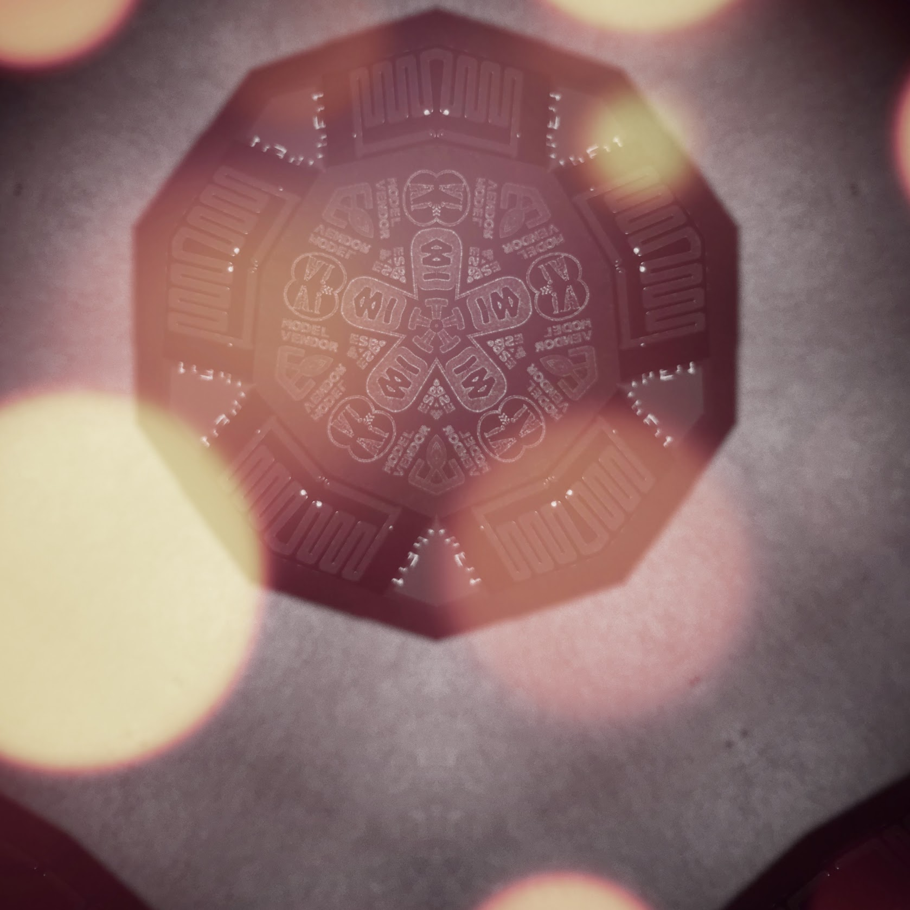
